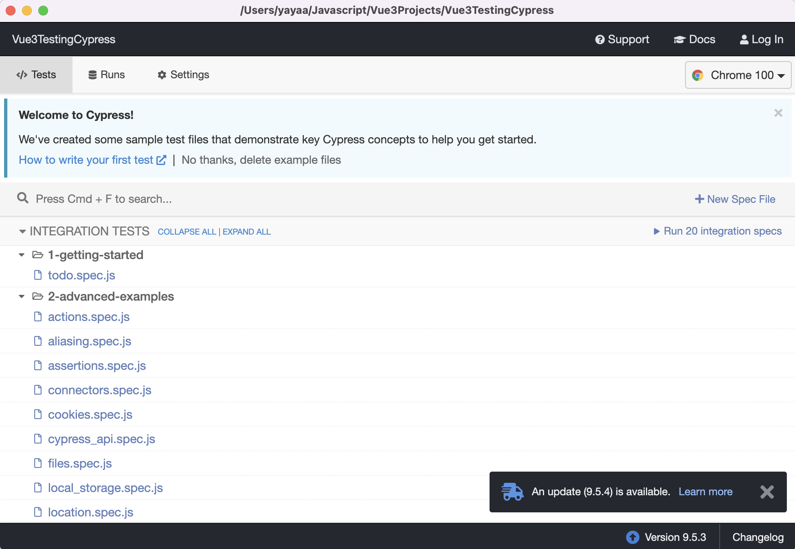

# Cypress 自动化测试

Cypress 是一款基于 **JavaScript** 的自动化测试工具。因此，使用 Cypress 自动化测试，需要掌握 JavaScript 基础语法、异步编程。在 Cypress 内部，其**行为驱动模式**依赖**回调函数**（异步编程）。

官方地址: [cypress.io](https://www.cypress.io/)

## 安装 Cypress

Cypress 测试脚本使用 JavaScript，依托于 [Node](https://nodejs.org/en/) 环境。

### Node 环境

> 推荐使用 Node 最新 LTS 版本

本地安装`Node`后，使用 `npm` 包管理工具安装`cypress`包。

### 注意事项

> Notice that the Cypress npm package is a wrapper around the Cypress binary. The version of the npm package determines the version of the binary downloaded. As of version 3.0, the binary is downloaded to a global cache directory to be used across projects.

根据官方文档描述，在项目中使用`npm`包管理工具安装`cypress`时，根据 Cypress 版本，在3.0后的版本，不在使用项目中通过`npm`安装的包启动`cypress`，而是使用全局本地缓存的 Cypress 二进制文件运行。

因此，在首次使用 Cypress 时，需要执行`npx cypress install`安装 Cypress 二进制文件。

> **如果使用 Node 环境安装，由于 npx 执行下载时默认使用国外官方镜像源，因此可能导致失败。推荐执行客户端安装或使用国内镜像源。**

### 安装 Cypress 二进制源文件

```shell
npx cypress install

# Installing Cypress (version: 9.5.3)

# ✔  Downloaded Cypress
# ✔  Unzipped Cypress
# ✔  Finished Installation /Users/yayaa/Library/Caches/Cypress/9.5.3
```

`npx`为 Node 内置命令，其作用主要用于安装对应模块内置依赖。

安装完成后：

```shell
# You can now open Cypress by running: node_modules/.bin/cypress open

# https://on.cypress.io/installing-cypress
```

首次启动:

```shell
npx cypress open

# It looks like this is your first time using Cypress: 9.5.3

# ✔  Verified Cypress! /Users/yayaa/Library/Caches/Cypress/9.5.3/Cypress.app

# Opening Cypress...
```

客户端如下所示：

