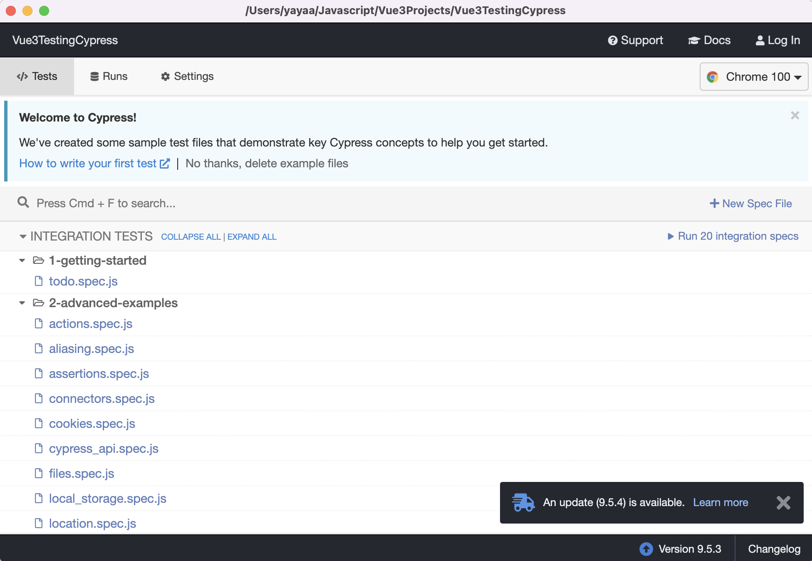
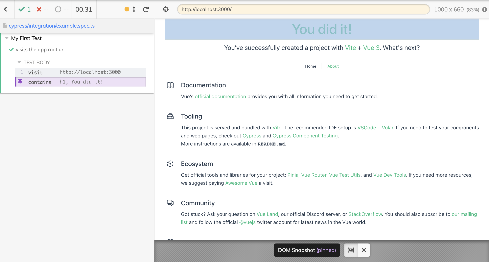
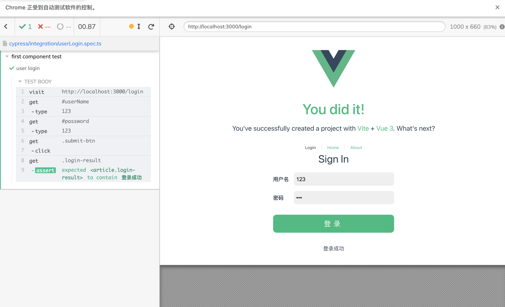
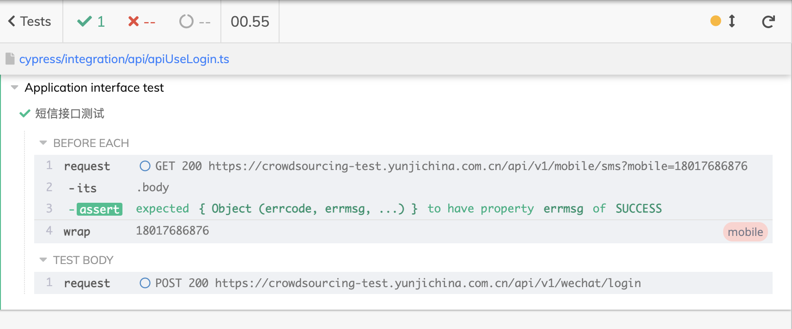

# Cypress 自动化测试

应该使用 PO设计模式。

Cypress 是一款基于 **JavaScript** 的自动化测试工具。因此，使用 Cypress 自动化测试，需要掌握 JavaScript 基础语法、异步编程。在 Cypress 内部，其**行为驱动模式**依赖**回调函数**（异步编程）。

官方地址: [cypress.io](https://www.cypress.io/)

## 安装 Cypress

Cypress 测试脚本使用 JavaScript，依托于 [Node](https://nodejs.org/en/) 环境。

### Node 环境

> 推荐使用 Node 最新 LTS 版本

本地安装`Node`后，使用 `npm` 包管理工具安装`cypress`包。

### 注意事项

> Notice that the Cypress npm package is a wrapper around the Cypress binary. The version of the npm package determines the version of the binary downloaded. As of version 3.0, the binary is downloaded to a global cache directory to be used across projects.

根据官方文档描述，在项目中使用`npm`包管理工具安装`cypress`时，根据 Cypress 版本，在3.0后的版本，不在使用项目中通过`npm`安装的包启动`cypress`，而是使用全局本地缓存的 Cypress 二进制文件运行。

因此，在首次使用 Cypress 时，需要执行`npx cypress install`安装 Cypress 二进制文件。

> **如果使用 Node 环境安装，由于 npx 执行下载时默认使用国外官方镜像源，因此可能导致失败。推荐执行客户端安装或使用国内镜像源。**

### 安装 Cypress 二进制源文件

```shell
npx cypress install

# Installing Cypress (version: 9.5.3)

# ✔  Downloaded Cypress
# ✔  Unzipped Cypress
# ✔  Finished Installation /Users/yayaa/Library/Caches/Cypress/9.5.3
```

`npx`为 Node 内置命令，其作用主要用于安装对应模块内置依赖。

安装完成后：

```shell
# You can now open Cypress by running: node_modules/.bin/cypress open

# https://on.cypress.io/installing-cypress
```

首次启动:

```shell
npx cypress open

# It looks like this is your first time using Cypress: 9.5.3

# ✔  Verified Cypress! /Users/yayaa/Library/Caches/Cypress/9.5.3/Cypress.app

# Opening Cypress...
```

客户端如下所示：



## 测试脚本

在安装 Cypress 后，会自动创建 cypress 目录，并存放对应脚本，目录结构如下所示：

```

cypress 
├── fixtures
│   └── example.json
├── integration
│   └── example.spec.ts
├── plugins
│   ├── index.ts
│   └── tsconfig.json
├── support
│   ├── commands.ts
│   └── index.ts
└── tsconfig.json

```

在`integration`中创建相应测试脚本。

### 组件测试示例

在组件测试中，我们主要验证该组件输入、输出是否符合预期，而不关注其内部实现。

测试类型：

- 组件测试：在 Cypress 中，其描述为 UI 视图测试，在实际项目中，应该关注组件抽离，以组件为单元进行测试，测试其输入输出是否符合预期。
- 接口测试：接口测试主要用户端到端（E2E）测试，用以检测实际接口请求/响应。

组件测试示例：

```javascript
describe('My First Test', () => {
  it('visits the app root url', () => {
    cy.visit('http://localhost:3000')
    cy.contains('h1', 'You did it!')
  })
})
```

Cypress 终端视图如下：



### 模拟组件测试

自定义组件`UserLogin`

```vue
<script setup lang="ts">
import useUserLogin from '@/composables/login/login'
defineProps<{ title: string }>()
const { username, password, submitHandle, loginMessage } = useUserLogin()
</script>

<template>
  <div id="userLogin">
    <h1>{{ title }}</h1>

    <section class="login-wrapper">
      <div class="custom_field_input">
        <label class="field_input_item field_title" for="username">用户名</label>
        <input
          autocomplete="false"
          class="field_input_item field_input"
          type="text"
          name="username"
          id="userName"
          v-model="username" />
      </div>
      <div class="custom_field_input">
        <label class="field_input_item field_title" for="password">密码</label>
        <input
          autocomplete="false"
          class="field_input_item field_input"
          type="password"
          name="password"
          id="password"
          v-model="password" />
      </div>
      <div class="submit-btn-wrapper">
        <button class="submit-btn" @click="submitHandle">登录</button>
      </div>

      <article class="login-result">
        <p>{{ loginMessage }}</p>
      </article>
    </section>
  </div>
</template>

<style scoped lang="less">
#userLogin {
  display: flex;
  flex-direction: column;
  justify-content: center;
  align-items: center;
  .login-wrapper {
    .custom_field_input {
      display: flex;
      align-items: center;
      margin: 1em 1em;
      .field_input_item {
        display: inline-block;
        min-width: 4em;
      }

      .field_title {
        font-weight: bold;
      }

      .field_input {
        width: 18em;
        font-size: 16px;
        box-sizing: border-box;
        padding: 0.2em 0.4em;
        border: none;
        line-height: 32px;
        margin: 0;
        background-color: #efefef;
        border-radius: 0.5em;
        outline: none;
        &:focus {
          background-color: rgba(240, 240, 240, 0.8);
          transition: background-color 200ms ease-out;
        }
      }
    }

    .submit-btn-wrapper {
      margin: 2em 1em;
      display: flex;
      align-items: center;
      justify-content: center;

      .submit-btn {
        width: 100%;
        padding: 0.6em 0.8em;
        border-radius: 0.5em;
        font-size: 20px;
        border: none;
        outline: none;
        color: #ffffff;
        background-color: hsla(160, 100%, 37%, 1);
        cursor: pointer;
        // opacity: 1;
        letter-spacing: 8px;
        display: flex;
        align-items: center;
        justify-content: center;
        &:hover {
          // opacity: 0.8;
          background-color: hsla(160, 100%, 37%, 0.8);
        }
      }
    }

    .login-result {
      line-height: 30px;
      height: 30px;
      text-align: center;
    }
  }
}
</style>

```

自定义用户校验`UserLogin`

```typescript
export default class UserLogin {
  private hasEmpty(username: string, password: string) {
    return !username || !password
  }

  private validator(reg: RegExp, value: string) {
    return reg.test(value)
  }

  login(name: string, pwd: string, nameReg: RegExp, pwdReg: RegExp) {
    if (this.hasEmpty(name, pwd)) {
      return false
    } else if (!this.validator(nameReg, name) || !this.validator(pwdReg, pwd)) {
      return false
    }

    return true
  }
}
```


组合函数`useUserLogin`

```typescript

import { computed, ref } from 'vue'
import UserLogin from './UserLogin'

export default function () {
  const username = ref('')
  const password = ref('')

  const user = new UserLogin()

  const nameReg = /\d/
  const pwdReg = /[a-zA-Z0-9]{3}/

  const loginStatus = ref(-1)

  const loginMessage = computed(() =>
    loginStatus.value > -1 ? (loginStatus.value === 1 ? '登录成功' : '登录失败') : ''
  )

  const submitHandle = () => {
    loginStatus.value = Number(user.login(username.value, password.value, nameReg, pwdReg))
  }

  return {
    username,
    password,
    loginMessage,
    submitHandle
  }
}

```

**OP测试示例**

使用配置对象封装选择器, `userLoginSelector.json`

```json
{
  "loginPage": {
    "loginComp": {
      "username": "#userName",
      "password": "#password",
      "submit": ".submit-btn",
      "message": ".login-result"
    }
  }
}
```

封装 Cypress 类`UserLoginTest`

```typescript
import userLoginSelector from './userLoginSelector.json'

export default class UserLoginTest {
  url: string
  constructor() {
    this.url = 'http://localhost:3000/login'
  }
  get username() {
    return cy.get(userLoginSelector.loginPage.loginComp.username)
  }

  get password() {
    return cy.get(userLoginSelector.loginPage.loginComp.password)
  }

  get submit() {
    return cy.get(userLoginSelector.loginPage.loginComp.submit)
  }

  get message() {
    return cy.get(userLoginSelector.loginPage.loginComp.message)
  }

  visit() {
    cy.visit(this.url)
  }

  check(message: string) {
    return this.message.should('contain', message)
  }

  login(name: string, pwd: string) {
    name && this.username.type(name)
    pwd && this.username.type(pwd)

    this.submit.click()
  }
}

```

测试用例`userLogin.spec.ts`

```typescript
import UserLoginTest from './userLogin_test'

describe('first component test', () => {
  it('user login', () => {
    const login = new UserLoginTest()
    login.visit()
    login.login('123', '123')
    login.check('登录成功')
  })
})

```

测试结果：



## 端到端（E2E）测试

端到端测试实际为接口测试，主要用来测试单个接口或关联接口。

```json
{
  "baseURL": "https://crowdsourcing-test.yunjichina.com.cn/api/v1/",
  "smsCodeUrl": "mobile/sms",
  "loginPath": "wechat/login"
}
```

```typescript
import apiConfig from './apiConfig.json'

export default class Tools {
  mobile: string
  constructor(mobile: string) {
    this.mobile = mobile
  }
  getSMSCode() {
    // const mobile = ''

    cy.request({
      url: apiConfig.baseURL + apiConfig.smsCodeUrl + '?mobile=' + this.mobile,
      method: 'GET',
      headers: {
        'Content-Type': 'application/json'
      }
    })
      .its('body')
      .should('contain', { errcode: 0, errmsg: 'SUCCESS' })
      .then(res => {
        console.log('res', res)
        cy.wrap(this.mobile).as('mobile')
      })
  }

  login(smsCode: string) {
    cy.request({
      url: apiConfig.baseURL + apiConfig.loginPath,
      method: 'POST',
      headers: {
        'Content-Type': 'application/json'
      },
      body: {
        mobile: this.mobile,
        smsCode: smsCode
      }
    }).then(res => {
      console.log(res)
    })
    // .its('body')
    // .should('contain', { errcode: 0, errmsg: 'SUCCESS' })
  }
}

```

```typescript
import Tools from './tools'

describe('Application interface test', () => {
  const tools = new Tools('18017686876')
  beforeEach(() => {
    tools.getSMSCode()
  })
  it('短信接口测试', function () {
    setTimeout(() => {
      // first
      tools.login('1785')
    }, 10000)
  })
})
```



## 构建 mock server

安装 faker 声称模拟数据`npm i -D faker`

使用 node fs 模块生成 json 数据，需要配置 `package.json` `并设置 type: 'module'`

使用 json-server 启动 json服务器`npm i json-server -D` 构建`resetful api` 框架

启动服务：

`json-server -w [filePath]`

> resetful api 是一种视一切请求为资源请求的接口服务框架。

### Restful API

- 增加资源： post请求
- 修改资源： put请求
- 删除资源： delete请求
- 查询资源： get请求